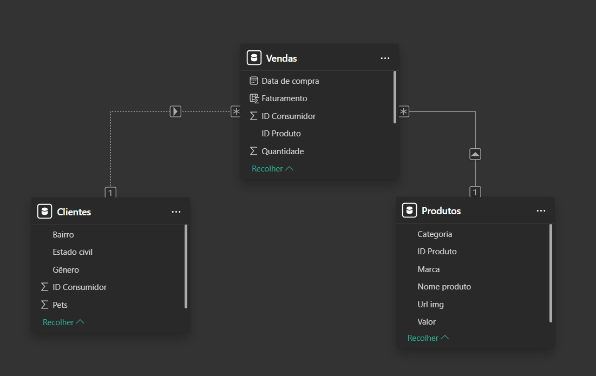

# 🐾 Gatito PetShop | Dashboard de Vendas com Power BI

Projeto completo de BI no Power BI simulando cenário real de negócio, com modelagem de dados, criação de métricas DAX e construção de dashboard estratégico para tomada de decisão.

##📊 Sobre o Projeto
O Gatito PetShop é um projeto de Business Intelligence desenvolvido com o objetivo de simular o cenário real de um pet shop e realizar uma análise completa de vendas.
O projeto foi construído do zero, incluindo:
1. 📁 Estruturação das bases de dados
2. 🧹 Tratamento de dados no Power Query
3. 🔗 Modelagem relacional
4. 📐 Criação de medidas com DAX
5. 🎨 Construção e estilização de dashboard

##🎯 Objetivos da Análise
Responder às seguintes perguntas estratégicas:
1. 💰 Qual o faturamento total do período?
2. 📦 Quantos produtos foram vendidos?
3. 🌈 Qual gênero gera mais faturamento?
4. 🏙️ Qual bairro possui mais consumidores?
5. 📅 Como o faturamento evoluiu ao longo do tempo?

##📦 Conceitos Aplicados
Durante o desenvolvimento do projeto, foram aplicados os seguintes conceitos:
1. ✔️ ETL (Extração, Transformação e Carga)
2. ✔️ Tratamento de dados no Power Query
3. ✔️ Modelagem de dados (relacionamento 1:N)
4. ✔️ Colunas calculadas com RELATED
5. ✔️ Medidas implícitas e explícitas
6. ✔️ Função SUM() no DAX
7. ✔️ Visualizações estratégicas
8. ✔️ Estilização e design de dashboard

## 📈 Dashboard Final / 🔎 Visão Geral:
1. 💵 Faturamento Total: R$ 2,03 Mi
2. 🐾 Média de Pets por Cliente: 2,61
3. 📦 Quantidade Total Vendida: 57 Mil

## 🎨 O dashboard foi desenvolvido com foco em:
1. Clareza visual
2. Identidade visual personalizada
3. Hierarquia da informação
4. Storytelling com dados

## 🔗 Modelo de Dados / O modelo foi estruturado com três tabelas principais:
1. Clientes
2. Produtos
3. Vendas
4. Relacionamentos do tipo 1:N, garantindo integridade e correta propagação de filtros.

## 💡 Ferramentas/técologias:
1. Power BI
2. DAX
3. Power Query
4. Excel
5. Canva

###🖼️ Imagens:
1. (Dashboard Gatito)

2. (Tabela)

